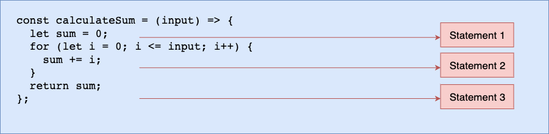

# ALgorithm

## What Big O

Big O notation is a metric for ***determining the efficiency of an algorithm***, it represent worst case complexity and define the runtime required to execute an algorithm. ***It also measures efficiency and performance of algorithm using time and space complexity***.

## What is Time and Space complexity

- Time complexity :- specifies how long it will take to execute an algorithm ***as a function of the input***.

- Time complexity :- specifies total amount of space or memory required to execute an algorithm ***as a function of the input***.

## Time as a function of input size

```
const calculateSum = (input) => {
    let sum = 0;
    for (let i = 0; i <= input; i++) {
        sum += i;
    }
    return sum;
};
```
We have an algorithm that computes the sum of numbers based on your input. If your input is 4, it will add 1+2+3 to output 10; if your input is 5, it will output 15 (meaning 1+2+3+4+5)



Looking at the image above, we only have three statements. Still, because there is a loop, the second statement will be executed based on the input size, so if the input is four, the second statement (statement 2) will be executed four times, meaning the entire algorithm will run six (4 + 2) times.

In plain terms, the algorithm will run input + 2 times, where input can be any number. This shows that it's expressed in terms of the input. In other words, it is a function of the input size.

## Big O Complexity Chart

Big O Chart, also Know as the Big O Graph is an asymptotic notation used to express the complexity of an algorithm or its performance as a function of input size.

This helps programmers to understand the worst case scenarion and the execution time or memory required by an algorithm.


## Type of complexity

There are 6 major types of complexities

1. Constant: O(1) -> Excellent/Best
2. Linear Time: O(n) -> Fair
3. Logarithmic Time: O(n log n) -> Bad
4. Quadratic Time: O(n^2) -> Worst
5. Exponential Time: O(2^n) -> Worst
6. Factorial Time: O(n!) -> Worst

You now understand the various time complexities, and you can recognize the best, good, and fair ones, as well as the bad and worst ones (always avoid the bad and worst time complexity).

## CheatSheet

1. When your ***calculation is not dependent on the input size, it's a constant time complexity (O(1))***.

2. When the ***input size is reduced by half, maybe when iterating hanndling recursion, or whatsoever, it is a logarithmic time complexity (O(log n))***.

3. When you have ***a single loop within your algorithm, it is linear time complexity (O(n))***.

4. When you have ***nested loop within your algorithm, meaning a loop in a loop it is quadratic time complexity (O(n^2))***.

5. When the ***growth rate doubles with each addition to the input, it is exponential time complexity (O2^n)***.

