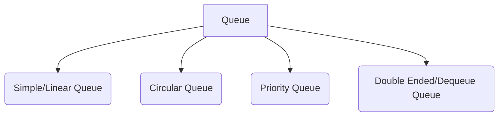
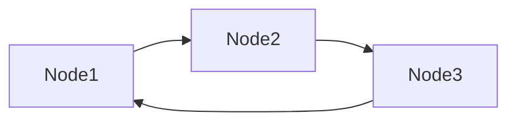

# Queue

Defined as ordered list, helps **insert** operations to be performed at one end called **rear** and **delete** for one end called **front**

## Types

- Simple Queue

Follows FIFO.

- Circular Queue

A circular queue is similar to the linear queue expect the last element of queue is connected to first element. It's aslo called as the ring buffer.

The representation of circular queue is shown in the below image -

