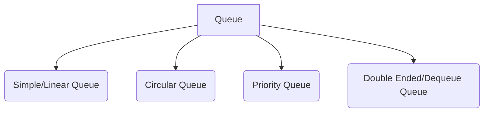
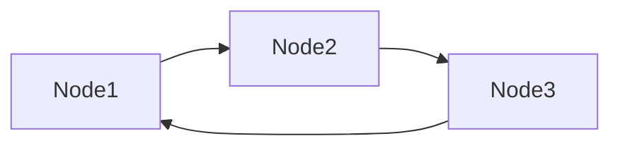
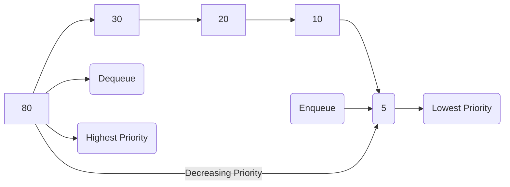
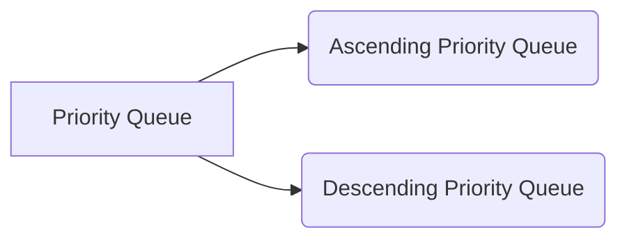
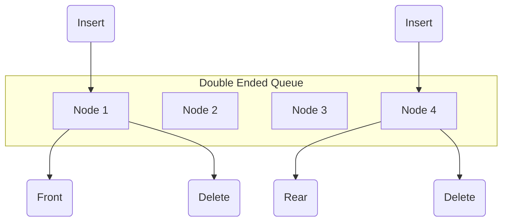
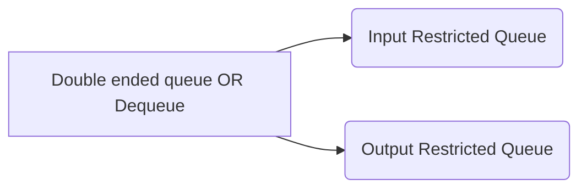

# Queue

Defined as ordered list, helps **insert** operations to be performed at one end called **rear** and **delete** for one end called **front**

## Types

## Simple Queue

Follows FIFO.

## Circular Queue

A circular queue is similar to the linear queue expect the last element of queue is connected to first element. It's aslo called as the ring buffer.

The representation of circular queue is shown in the below image -

## Priority Queue

A queue which is arranged on the basis of the priority.Special type of queue where elements are arranged on priority associated with it.Elements with same amount of priority will be arranged on FIFO base's.

- Types of Priority queue

## Double ended queue OR Dequeue

Insertion and deletion can be done from both ends of queue either from front or rear. Can be used as an palindrome checker (if we can read string from both ends, then the string would be same).

Dequeue can be used both as stack and queue as they both follow LIFO
Dequeue doesn't follow FIFO

- Types of Double ended queue OR Dequeue

