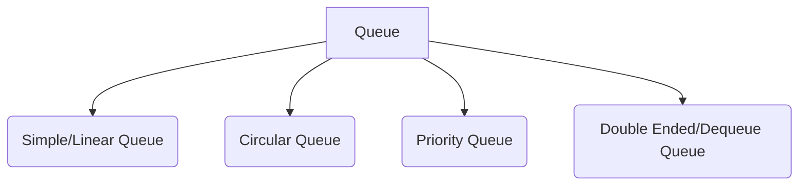

# Queue

Defined as ordered list, helps **insert** operations to be performed at one end called **rear** and **delete** for one end called **front**

## Types

```mermaid
graph TD
    A[Queue] --> B(Simple/Linear Queue)
    A[Queue] --> c(Circular Queue)
    A[Queue] --> d(Priority Queue)
    A[Queue] --> E(Double Ended/Dequeue Queue)
```
