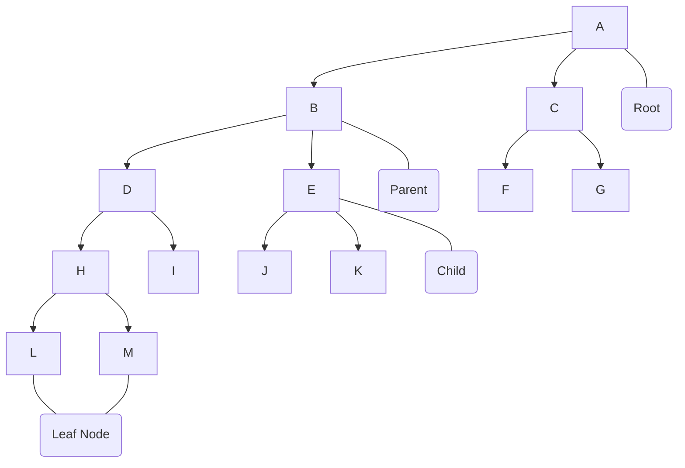

# Tree

Tree is used to represent data in hierarchical data. A method to organize and store data more effectively. It consist of a central node, structural nodes, and sub-nodes, which are connected via edges.

