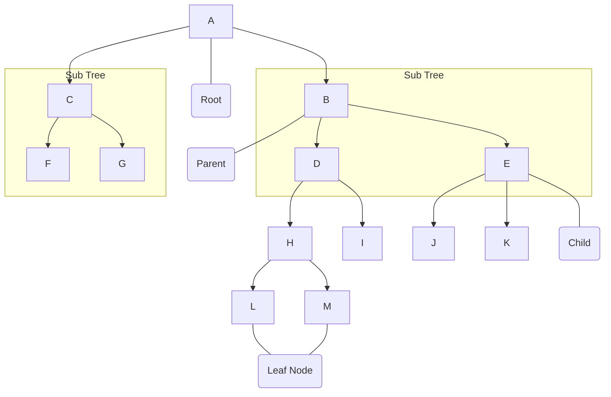
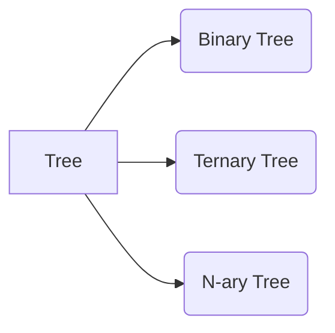
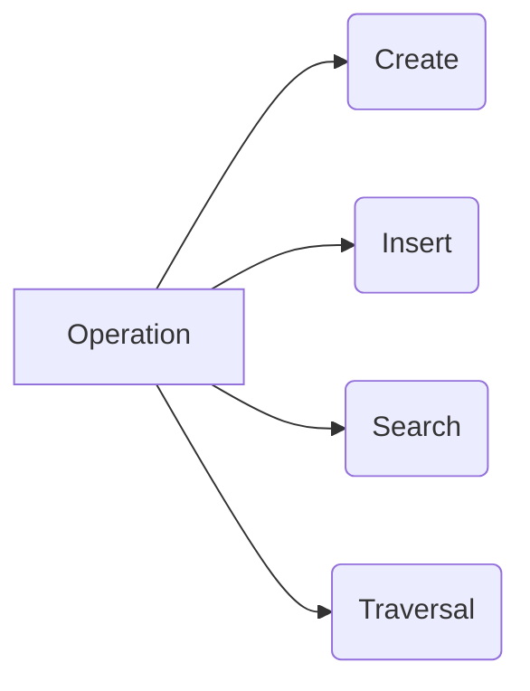
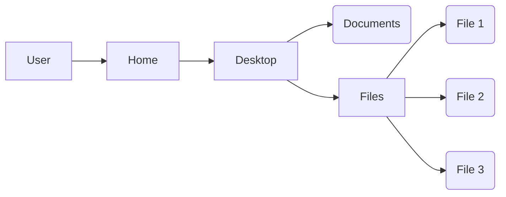

# Tree

Tree is used to represent data in hierarchical data. A method to organize and store data more effectively. It consist of a central node, structural nodes, and sub-nodes, which are connected via edges.

## Type of tree

- Binary tree: In a binary tree, each node can have a maximum of two children linked to it. Some common types of binary trees include full binary trees, complete binary trees, balanced binary trees, and degenerate or pathological binary trees.
  

- Ternary Tree: A Ternary Tree is a tree data structure in which each node has at most three child nodes, usually distinguished as “left”, “mid” and “right”.

- N-ary Tree or Generic Tree: Generic trees are a collection of nodes where each node is a data structure that consists of records and a list of references to its children(duplicate references are not allowed). Unlike the linked list, each node stores the address of multiple nodes.

## Operation of tree

## Real life example for tree DS (file system)
