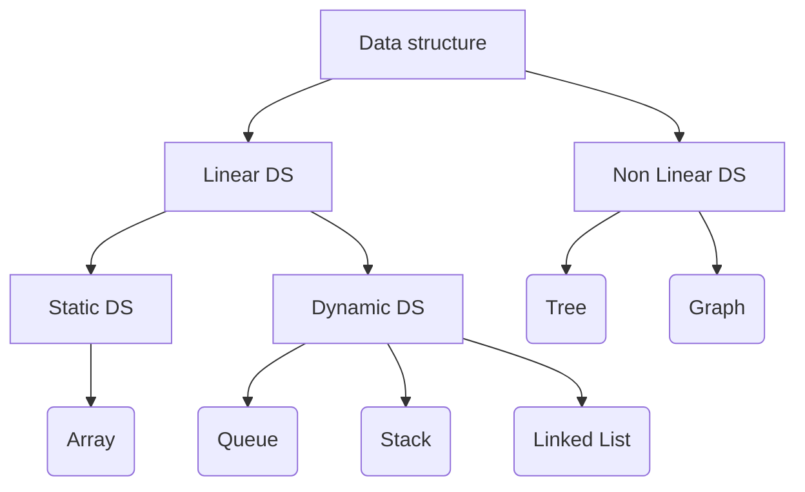

<h2>Data structure and algorithms</h2>

This repository will give an basic idea of the common data structure using Javascript.

<strong>
    
Detalied explanation to all the data structure have been given in their particular folder.

</strong>

## What are data structure

In simple words, a data structure is a way of organizing and storing data in a computer so that it can be accessed and used efficiently. It provides a way to represent and manipulate data in a logical and organized manner, making it easier to perform operations like searching, sorting, and modifying the data

## Types of DS

<!-- If you like my work dont forget to star this repository and follow @thejunghare -->
